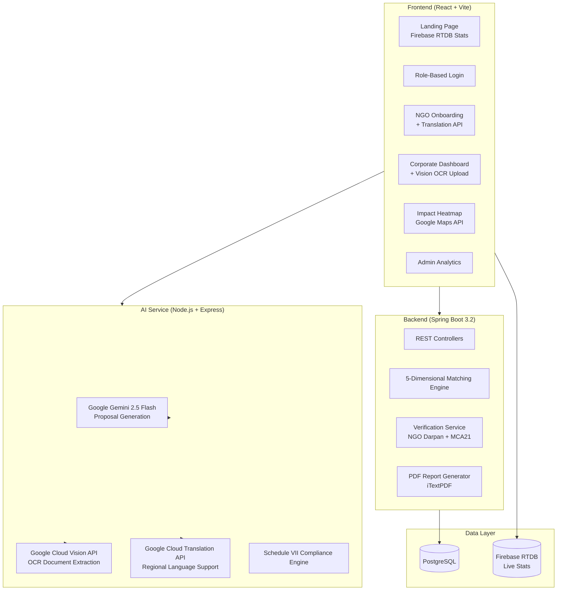

<div align="center">

# 🌉 ImpactBridge

### AI-Powered CSR Capital Allocation Engine for India

*Bridging ₹15,000 Cr in corporate CSR mandates with ₹170B in unmet grassroots need*

[](https://developers.google.com/community/gdsc-solution-challenge)
[](https://sdgs.un.org/goals/goal1)
[](https://sdgs.un.org/goals/goal4)
[](https://sdgs.un.org/goals/goal10)
[](https://sdgs.un.org/goals/goal17)

</div>

---

## 📋 Problem Statement

> **Open Innovation — Smart Resource Allocation: Data-Driven Volunteer Coordination for Social Impact**

Local social groups and NGOs collect critical community needs data through paper surveys and field reports. This data remains **scattered, siloed, and invisible** to the corporates legally mandated to fund social impact (Companies Act 2013, Section 135). The result:

- **₹15,000+ Crore** in annual CSR budget remains underutilized or misallocated
- **112 Aspirational Districts** remain critically underserved
- Grassroots NGOs lack the corporate vocabulary to write fundable proposals
- No unified system exists to match supply (corporate funds) with demand (community needs)

---

## 💡 Our Solution

**ImpactBridge** is a full-stack AI-powered platform that:

1. **Empowers grassroots NGOs** to describe their work in plain language (even regional languages) and auto-generates corporate-ready funding proposals using Generative AI
2. **Enables corporates** to upload CSR policies (text or scanned documents) and instantly discover high-impact NGOs matched to their mandate
3. **Visualizes CSR gaps** on a real-time heatmap to identify underserved regions
4. **Automates compliance** with Schedule VII of the Companies Act 2013

```
┌─────────────────────────────────────────────────────────────────────┐
│                        ImpactBridge Flow                           │
│                                                                     │
│  NGO describes work     →  AI generates proposal  →  Platform      │
│  (any language)            (Schedule VII ready)       matches with  │
│                                                       corporates   │
│                                                                     │
│  Corporate uploads      →  Vision API extracts    →  Smart 5D      │
│  CSR policy (PDF/img)      text automatically        matching      │
│                                                                     │
│  Match found            →  Express Interest       →  Fund & Track  │
│                            + Handshake                + PDF Report  │
└─────────────────────────────────────────────────────────────────────┘
```

---

## 🏗️ Architecture



---

## 🔧 Google Technologies Used

| Technology | Purpose |
|---|---|
| **Google Gemini 2.5 Flash** | Generative AI for proposal creation, CSR policy parsing, match explanations, and NGO description analysis |
| **Google Cloud Vision API** | OCR extraction from uploaded CSR policy PDFs and images, enabling corporates to upload documents instead of copy-pasting text |
| **Google Cloud Translation API** | Auto-detects language of NGO descriptions and translates to English, ensuring grassroots NGOs writing in regional languages are not excluded |
| **Google Maps JavaScript API** | Interactive heatmap visualization of CSR gaps across India's 112 Aspirational Districts |
| **Firebase Realtime Database** | Live platform statistics (NGOs registered, matches made, beneficiaries reached) displayed as animated counters on the landing page |
| **Firebase Hosting** | Production deployment of the frontend application |

---

## 🧠 Smart Matching Algorithm

The matching engine uses a **5-dimensional scoring model** (max 100 points):

| Dimension | Weight | What It Measures |
|---|---|---|
| **Geographic Proximity** | 20 pts | State overlap + Aspirational District bonus |
| **Thematic Alignment** | 30 pts | NGO focus area vs. corporate CSR mandate |
| **Budget Compatibility** | 20 pts | NGO request vs. corporate allocation |
| **Compliance Score** | 15 pts | Registration type, FCRA status, Schedule VII match |
| **Impact Density** | 15 pts | Beneficiaries per rupee, years active, credibility |

---

## 📁 Project Structure

```
impactbridge/
├── frontend/                    # React + Vite
│   ├── src/
│   │   ├── components/
│   │   │   ├── PixelCard.jsx    # Animated neobrutalist cards
│   │   │   ├── Carousel.jsx     # Feature showcase carousel
│   │   │   ├── Navbar.jsx       # Role-aware navigation
│   │   │   └── VerificationPanel.jsx
│   │   ├── context/
│   │   │   └── AuthContext.jsx  # Role-based access control
│   │   ├── config/
│   │   │   └── firebase.js      # Firebase RTDB config
│   │   ├── pages/
│   │   │   ├── Landing.jsx      # Hero + stats + carousel
│   │   │   ├── Login.jsx        # Role selection gateway
│   │   │   ├── NgoOnboard.jsx   # NGO form + Translation
│   │   │   ├── CorporateDashboard.jsx  # Matches + OCR upload
│   │   │   ├── HeatMap.jsx      # Google Maps heatmap
│   │   │   └── AdminDashboard.jsx
│   │   └── services/
│   │       └── api.js           # All API integrations
│   └── package.json
│
├── backend/                     # Spring Boot 3.2 + Java 17
│   └── src/main/java/com/impactbridge/
│       ├── controller/          # REST endpoints
│       ├── service/             # Business logic
│       │   ├── MatchingService.java    # 5D scoring engine
│       │   ├── VerificationService.java # ID validation
│       │   └── ReportService.java      # PDF generation
│       ├── entity/              # JPA entities
│       ├── dto/                 # Request/Response DTOs
│       ├── repository/          # Spring Data JPA
│       └── config/              # CORS, DataLoader
│
├── ai-service/                  # Node.js + Express
│   ├── index.js                 # API routes
│   ├── services/
│   │   └── geminiService.js     # Gemini + Vision + Translation
│   └── data/
│       └── scheduleVII.json     # Indian CSR law reference
│
└── README.md
```

---

## 🚀 Getting Started

### Prerequisites

- **Node.js** 18+
- **Java** 17+
- **PostgreSQL** 15+
- **Google Cloud** account with Vision, Translation, and Maps APIs enabled

### 1. Clone & Install

```bash
git clone https://github.com/YOUR_USERNAME/impactbridge.git
cd impactbridge

# Frontend
cd frontend && npm install

# AI Service
cd ../ai-service && npm install
```

### 2. Configure Environment

**Frontend** (`frontend/.env`):
```env
VITE_BACKEND_URL=http://localhost:8080
VITE_AI_SERVICE_URL=http://localhost:3001
VITE_GOOGLE_MAPS_KEY=your_google_maps_api_key
```

**AI Service** (`ai-service/.env`):
```env
GEMINI_API_KEY=your_gemini_api_key
GOOGLE_API_KEY=your_google_api_key
PORT=3001
```

**Backend** (`backend/src/main/resources/application.properties`):
```properties
spring.datasource.url=jdbc:postgresql://localhost:5432/impactbridge
spring.datasource.username=postgres
spring.datasource.password=your_password
```

### 3. Create Database

```sql
CREATE DATABASE impactbridge;
```
> Tables are auto-generated by Hibernate on first run.

### 4. Run All Services

```bash
# Terminal 1 — Backend (Spring Boot)
cd backend
./apache-maven-3.9.6/bin/mvn spring-boot:run

# Terminal 2 — AI Service
cd ai-service
node index.js

# Terminal 3 — Frontend
cd frontend
npm run dev
```

### 5. Access the App

| Service | URL |
|---|---|
| Frontend | http://localhost:5173 |
| Backend API | http://localhost:8080 |
| AI Service | http://localhost:3001 |
| Swagger Docs | http://localhost:8080/swagger-ui.html |

---

## 🎯 Demo Flow

1. **Landing Page** → View live stats from Firebase RTDB, explore platform features via Carousel
2. **Login** → Select role (NGO / Corporate / Admin)
3. **NGO Onboarding** → Type description in Hindi → Click "Translate to English" (Translation API) → Generate AI Proposal (Gemini)
4. **Submit to Platform** → NGO becomes visible to matching engine
5. **Corporate Dashboard** → Upload CSR policy PDF (Vision API OCR) → Parse & auto-fill → View AI-matched NGOs
6. **Express Interest** → Initiate handshake → Mark as Funded → Download compliance PDF report
7. **Impact Heatmap** → Visualize CSR gaps across Aspirational Districts (Google Maps)

---

## 🔐 Role-Based Access Control

| Role | Accessible Pages |
|---|---|
| **NGO** | NGO Onboarding, Impact Map |
| **Corporate** | Corporate Dashboard, Impact Map |
| **Admin** | Admin Analytics, Impact Map |
| **Unauthenticated** | Landing Page, Login, Impact Map |

---

## 📊 API Endpoints

### Backend (Spring Boot)
| Method | Endpoint | Description |
|---|---|---|
| POST | `/api/ngos` | Register new NGO |
| GET | `/api/ngos` | List all NGOs |
| PUT | `/api/ngos/{id}/publish` | Publish NGO to matching pool |
| POST | `/api/corporates` | Register corporate |
| GET | `/api/matches/{corpId}` | Get AI matches for corporate |
| POST | `/api/matches/express-interest` | Express interest in NGO |
| POST | `/api/matches/{id}/fund` | Mark match as funded |
| GET | `/api/reports/corporate/{id}/pdf` | Download CSR compliance report |
| GET | `/api/heatmap` | Get heatmap data points |
| GET | `/api/stats` | Platform statistics |

### AI Service (Node.js)
| Method | Endpoint | Description |
|---|---|---|
| POST | `/generate-proposal` | Generate AI proposal from NGO description |
| POST | `/parse-csr-policy` | Parse corporate CSR policy text |
| POST | `/api/ai/vision-ocr` | Extract text from uploaded image/PDF (Vision API) |
| POST | `/api/ai/translate` | Translate text to English (Translation API) |
| POST | `/check-compliance` | Check Schedule VII compliance |

---

## 🛠️ Tech Stack

| Layer | Technology |
|---|---|
| Frontend | React 18, Vite, Framer Motion |
| Backend | Spring Boot 3.2, Java 17, Hibernate |
| AI Engine | Google Gemini 2.5 Flash |
| OCR | Google Cloud Vision API |
| Translation | Google Cloud Translation API |
| Maps | Google Maps JavaScript API |
| Realtime Data | Firebase Realtime Database |
| Database | PostgreSQL |
| PDF Generation | iTextPDF |
| Deployment | Firebase Hosting, Render |

---

## 🎨 Design Philosophy

ImpactBridge uses a **Neobrutalist** design language with:
- High-contrast typography and bold borders
- Animated **PixelCard** components with canvas-based particle effects
- **Carousel** with 3D perspective transforms for feature showcasing
- Dark-mode pixel cards with shimmer animations on hover
- Intersection Observer-driven animated counters for live stats

---

## 👥 Team

Built for **GDSC Solution Challenge 2026**

---

## 📄 License

This project is licensed under the MIT License.
